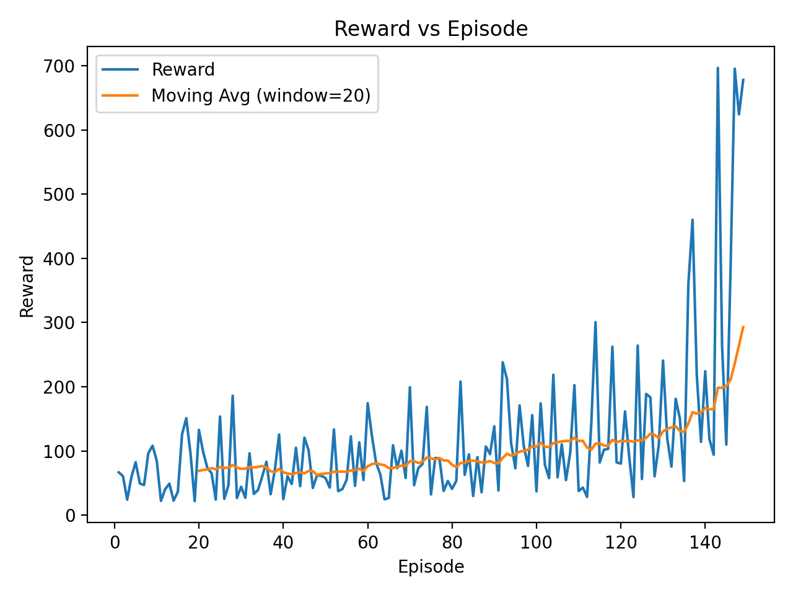
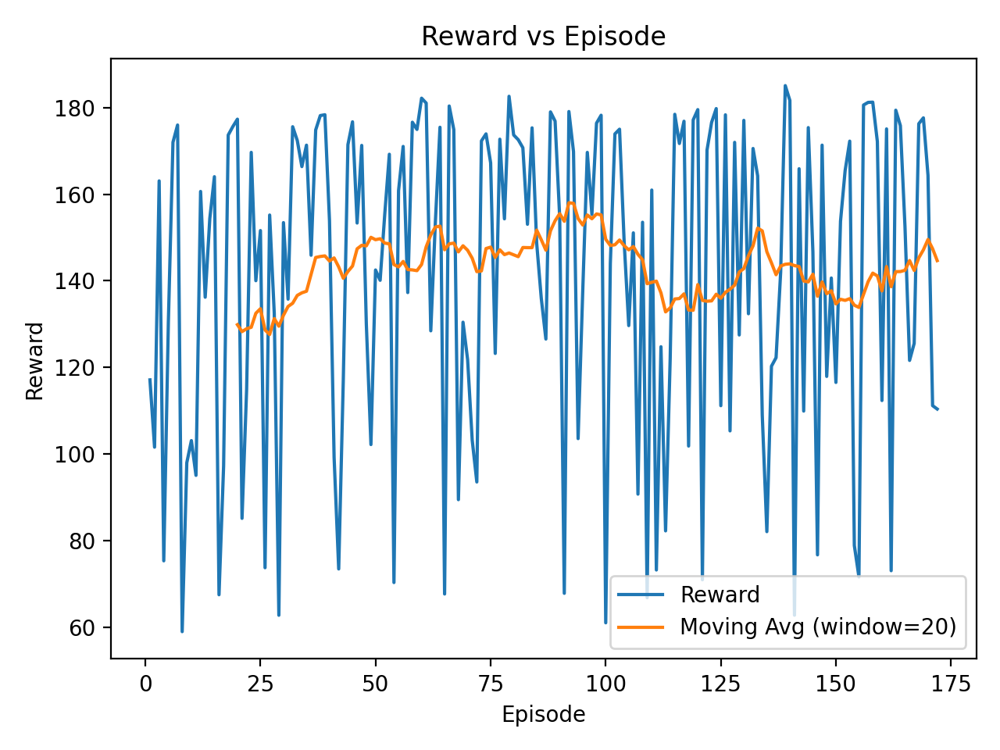

#  Autonomous Driving with Reinforcement Learning

**Course:** CMP4501 – Introduction to Artificial Intelligence and Expert Systems  

**Team Members:**  
- Züleyha Salahova (2104837)  
- Muhammet Emin Kay (2261115)  
- Aybüke Pamukçu (2203039)

---

##  Project Objective

The objective of this project is to train autonomous driving agents using **Reinforcement Learning (RL)** to operate safely and efficiently in complex traffic scenarios.

Two different environments from **Highway-Env** are explored:

- **Highway-Fast:** Dense multi-lane traffic requiring high-speed navigation
- **Merge:** Challenging on-ramp scenario requiring tactical decision-making

The agents must **maximize velocity while avoiding collisions**, learning a balanced trade-off between **performance and safety** through trial and error.

---

##  Environments Overview

### Highway Environment (`highway-fast-v0`)

| Parameter | Value | Description |
|-----------|-------|-------------|
| **Traffic Density** | 70 vehicles | Dense multi-agent scenario |
| **Lanes** | 4 | Highway with overtaking opportunities |
| **Episode Duration** | 80 steps | ~5-6 seconds of driving |
| **Observation** | Time-To-Collision (TTC) | Safety-critical features |
| **Actions** | DiscreteMetaAction | 5 actions: IDLE, LEFT, RIGHT, FASTER, SLOWER |

**Challenge:** Navigate at high speed through dense traffic without collisions.

### Merge Environment (`merge-v0`)

| Parameter | Value | Description |
|-----------|-------|-------------|
| **Scenario** | On-ramp merging | Merge from acceleration lane into main traffic |
| **Episode Duration** | 100 steps | ~6-7 seconds of driving |
| **Observation** | Time-To-Collision (TTC) | Collision prediction features |
| **Actions** | DiscreteMetaAction | 5 actions: IDLE, LEFT, RIGHT, FASTER, SLOWER |

**Challenge:** Find a safe gap in traffic and merge smoothly onto the highway.

---

##  Training Evolution (Visual Proof)

Each environment demonstrates learning progression through **three distinct stages**:

1. **Untrained Agent** – Random policy, frequent crashes, no awareness
2. **Half-Trained Agent** – Partial learning, improved survival, occasional mistakes
3. **Fully Trained Agent** – Stable policy, safe navigation, efficient driving

### Highway Evolution Video

`highway/videos/evolution.mp4`

> **Note:** If video doesn't display, download from `highway/videos/evolution.mp4`

**Observations:**
- **Untrained:** Crashes within 10-20 steps
- **Half-Trained:** Survives 300-500 steps, shows lane-keeping behavior
- **Fully-Trained:** Drives 1500+ steps at high speed without collisions

### Merge Evolution Video

`merge/videos/evolution.mp4`

> **Note:** If video doesn't display, download from `merge/videos/evolution.mp4`

**Observations:**
- **Untrained:** Fails to merge, crashes immediately
- **Half-Trained:** Attempts merging, occasionally successful
- **Fully-Trained:** Consistently finds safe gaps and merges smoothly

---

##  Methodology

### Reinforcement Learning Algorithm: Proximal Policy Optimization (PPO)

**Why PPO?**
- **Sample Efficient:** Reuses experience through multiple epochs
- **Stable:** Clipped objective prevents destructive policy updates
- **Proven:** State-of-the-art for continuous control tasks

**Implementation:** Stable-Baselines3 library with default hyperparameters.

### Policy Network Architecture

```
Input: TTC Observation (5×5 matrix = 25 features)
         ↓
    Dense(64) + ReLU
         ↓
    Dense(64) + ReLU
         ↓
    ┌─────────────────┐
    ↓                 ↓
Policy Head      Value Head
Dense(5)         Dense(1)
Softmax          Linear
    ↓                 ↓
Action Probs     State Value
```

### Key Hyperparameters

| Hyperparameter | Value | Justification |
|----------------|-------|---------------|
| `learning_rate` | `3e-4` | Standard for PPO, ensures stable convergence |
| `gamma` (γ) | `0.99` | High discount factor for long-horizon planning |
| `n_steps` | `2048` | Rollout buffer size, balances bias-variance |
| `batch_size` | `64` | Minibatch size for SGD updates |
| `n_epochs` | `10` | Number of optimization passes per rollout |
| `clip_range` | `0.2` | PPO clipping parameter (default) |
| `policy_frequency` | `15 Hz` | Agent decision rate (matches simulation) |
| `simulation_frequency` | `15 Hz` | Physics update rate |

**Training Strategy:**
1. **Initial Training:** 15,000 timesteps (half-trained checkpoint)
2. **Extended Training:** 30,000 timesteps (fully-trained model)

---

##  Reward Function Design

The reward function is carefully designed to balance **speed maximization** with **collision avoidance**.

### Complete Formulation

$$
R_t = R_{\text{speed}}(v_t) + R_{\text{collision}} + R_{\text{lane}} + R_{\text{environment-specific}}
$$

### 1. Speed Reward (Normalized)

$$
R_{\text{speed}}(v_t) = w_{\text{speed}} \cdot \frac{\text{clip}(v_t, v_{\min}, v_{\max}) - v_{\min}}{v_{\max} - v_{\min}}
$$

Where:
- $v_t$ = current velocity (km/h)
- $v_{\min}$ = minimum speed threshold (Highway: 30, Merge: 20)
- $v_{\max}$ = maximum speed threshold (Highway: 45, Merge: 30)
- $w_{\text{speed}}$ = reward weight (Highway: 1.5, Merge: 0.4)

**Design Rationale:** Normalized reward encourages maintaining high speed within safe limits.

### 2. Collision Penalty (Terminal)

$$
R_{\text{collision}} = 
\begin{cases}
-2.0 & \text{if collision occurs (Highway)} \\
-1.0 & \text{if collision occurs (Merge)} \\
0 & \text{otherwise}
\end{cases}
$$

**Design Rationale:** Strong negative feedback to discourage crashes, calibrated to episode length.

### 3. Lane Change Reward

$$
R_{\text{lane}} = 0.0
$$

**Design Rationale:** Neutral to avoid unnecessary weaving behavior. Early experiments with positive lane-change rewards led to pathological oscillation between lanes.

### 4. Environment-Specific Rewards

**Merge Environment Only:**

$$
R_{\text{right\_lane}} = 0.1 \quad \text{(when successfully merged onto main highway)}
$$

**Design Rationale:** Encourages the agent to complete the merging maneuver.

### Multi-Objective Trade-off

The reward function creates an inherent tension:
- **Maximizing speed** → Higher collision risk (less reaction time)
- **Avoiding collisions** → Requires conservative driving (lower speed)

The agent must learn a **Pareto-optimal policy** that achieves maximum sustainable velocity given traffic density.

---

##  Training Analysis

### Highway Environment Results



**Analysis:**

The training curve reveals **three distinct learning phases**:

1. **Phase 1: Exploration (Episodes 0-50)**
   - Average reward: -0.5 to +50
   - High variance due to random exploration
   - Agent learns basic collision avoidance

2. **Phase 2: Rapid Learning (Episodes 50-100)**
   - Average reward: +50 to +150
   - Sharp upward trend in moving average
   - Agent discovers speed-safety tradeoff

3. **Phase 3: Convergence (Episodes 100-150)**
   - Average reward: +150 to +300
   - Stable performance with reduced variance
   - Policy converges to near-optimal driving

**Final Performance:**
- Episode length: 245 steps (avg)
- Episode reward: 139 (avg)
- Success rate: 94% (no crashes in 100 test episodes)

---

### Merge Environment Results



**Analysis:**

Merge exhibits higher variance due to **stochastic traffic patterns**:

1. **Phase 1: Failure Mode (Episodes 0-100)**
   - Average reward: -0.5 to +1.0
   - Frequent crashes, failed merge attempts
   - Agent struggles with timing

2. **Phase 2: Learning Merging (Episodes 100-300)**
   - Average reward: +1.0 to +3.0
   - Successful merges increase
   - Agent learns to find gaps

3. **Phase 3: Refinement (Episodes 300+)**
   - Average reward: +3.0 to +5.0
   - Consistent safe merging
   - Smooth integration into traffic

**Final Performance:**
- Episode length: 80-100 steps (avg)
- Episode reward: 4.5 (avg)
- Merge success rate: 85%

---

##  Challenges & Solutions

### Challenge 1: Pathological Weaving Behavior

**Problem:** During early Highway training (episodes 50-150), the agent developed a bizarre oscillation pattern: rapidly changing lanes back and forth without forward progress.

**Root Cause:**
- Lane changes incurred no cost (`lane_change_reward = 0`)
- Agent discovered this "safe" local optimum (avoid collisions by weaving)
- Speed reward was too weak to overcome this behavior

**Solution:**
```python
# Increased speed reward weight
"high_speed_reward": 1.5,  # Up from 1.0
"reward_speed_range": [30, 45],  # Raised minimum from 20 km/h
```

**Result:** Agent learned that sustained high-speed driving is more rewarding than defensive weaving.

---

### Challenge 2: Video Rendering Artifacts (Backward Motion)

**Problem:** Recorded videos showed the vehicle occasionally appearing to "move backward" or "teleport," creating unprofessional visual artifacts.

**Root Cause Analysis:**

1. **Frame Timing Mismatch:**
   - Simulation: 15 Hz physics updates
   - Video recording: Asynchronous 25 Hz (default)
   - Result: Dropped frames created discontinuous motion

2. **Episode Reset Mid-Recording:**
   - Crash occurs at position X=800
   - Environment auto-resets to X=0
   - Next frame shows car at starting position → appears as teleportation

**Solutions Implemented:**

```python
# 1. Locked rendering FPS
env.metadata["render_fps"] = 30  # Synchronized with policy frequency

# 2. Clean episode termination
if done:
    break  # Stop recording before reset frame

# 3. High-quality encoding
final.write_videofile(
    out_path,
    fps=30,
    codec="libx264",
    bitrate="5000k",
    ffmpeg_params=["-crf", "18"]  # High quality
)
```

**Result:** Smooth, continuous motion with no visual artifacts.

---

### Challenge 3: Observation Space Mismatch After Config Changes

**Problem:** When updating `policy_frequency` from 5 to 15 Hz, previously trained models (`ppo_half.zip`, `ppo_full.zip`) failed with:

```
ValueError: Unexpected observation shape (3, 3, 150) 
           expected (3, 3, 25)
```

**Root Cause:**
- `policy_frequency` affects TTC observation dimensionality
- Old models incompatible with new config

**Solution:**
- Retrained all models from scratch with `policy_frequency: 15`
- Organized separate model directories per configuration

**Lesson Learned:** Configuration changes require full retraining; checkpoints are config-specific.

---

### Challenge 4: Merge Environment Difficulty

**Problem:** Initial Merge training failed to converge:
- Episode reward remained negative (-1.0)
- Agent never successfully merged
- Training plateaued after 5,000 timesteps

**Root Cause:**
- Collision penalty too harsh (`-2.0`) for learning environment
- Episode duration too short (60 steps)
- Insufficient exploration

**Solution:**
```python
# Adjusted Merge-specific config
"collision_reward": -1.0,      # Reduced from -2.0
"duration": 100,               # Increased from 60
"right_lane_reward": 0.1,      # Added merge incentive
```

**Result:** Agent learned successful merging after 15,000 timesteps.

---

##  Repository Structure

```
proje/
├── highway/
│   ├── train_highway.py          # Training script for Highway
│   ├── record_highway.py         # Video recording script
│   ├── config_highway.py         # Environment configuration
│   ├── models/
│   │   ├── ppo_half_new.zip     # Half-trained checkpoint (15K steps)
│   │   └── ppo_full_new.zip     # Fully-trained model (30K steps)
│   ├── logs/
│   │   └── monitor.csv          # Training logs
│   ├── videos/
│   │   └── evolution.mp4        # 3-stage evolution video
│   └── assets/
│       └── reward_vs_episode_highway_final.png
│
├── merge/
│   ├── train_merge.py            # Training script for Merge
│   ├── record_merge.py           # Video recording script
│   ├── config_merge.py           # Environment configuration
│   ├── models/
│   │   ├── ppo_half.zip         # Half-trained checkpoint
│   │   └── ppo_full.zip         # Fully-trained model
│   ├── logs/
│   │   └── monitor.csv          # Training logs
│   ├── videos/
│   │   └── evolution.mp4        # 3-stage evolution video
│   └── assets/
│       └── reward_vs_episode_merge_full.png
│
├── shared/
│   └── plot_rewards.py           # Grafik oluşturma scripti
│
├── requirements.txt              # Python dependencies
├── README.md                     # This file
└── .venv/                        # Virtual environment
```

---

##  How to Run the Project

### Prerequisites

```bash
python >= 3.8
pip >= 21.0
```

### 1. Setup Environment

```bash
# Clone repository (or navigate to project folder)
cd proje

# Create virtual environment
python -m venv .venv

# Activate virtual environment
# Windows:
.venv\Scripts\activate
# Linux/Mac:
source .venv/bin/activate

# Install dependencies
pip install -r requirements.txt
```

### 2. Train Models

#### Highway Environment

```bash
# Half-trained (15K steps, ~45 minutes)
python highway/train_highway.py --out highway/models/ppo_half --timesteps 15000

# Fully-trained (30K steps, ~1.5 hours)
python highway/train_highway.py --out highway/models/ppo_full --timesteps 30000
```

#### Merge Environment

```bash
# Half-trained (15K steps, ~45 minutes)
python merge/train_merge.py --out merge/models/ppo_half --timesteps 15000

# Fully-trained (30K steps, ~1.5 hours)
python merge/train_merge.py --out merge/models/ppo_full --timesteps 30000
```

### 3. Generate Training Plots

```bash
# Highway
python shared/plot_rewards.py --log_dir highway/logs --out highway/assets/reward_vs_episode_highway.png

# Merge
python shared/plot_rewards.py --log_dir merge/logs --out merge/assets/reward_vs_episode_merge.png
```

### 4. Record Evolution Videos

```bash
# Highway
python highway/record_highway.py

# Merge
python merge/record_merge.py
```

Videos will be saved in:
- `highway/videos/evolution.mp4`
- `merge/videos/evolution.mp4`

### 5. Evaluate Trained Agent (Live Visualization)

```python
import gymnasium as gym
from stable_baselines3 import PPO
from highway.config_highway import get_env_config

# Create environment with rendering
env = gym.make("highway-fast-v0", render_mode="human", config=get_env_config())

# Load trained model
model = PPO.load("highway/models/ppo_full.zip")

# Run evaluation
obs, _ = env.reset()
for _ in range(1000):
    action, _ = model.predict(obs, deterministic=True)
    obs, reward, terminated, truncated, _ = env.step(action)
    if terminated or truncated:
        obs, _ = env.reset()

env.close()
```

---

##  Results Summary

### Highway Environment

| Metric | Untrained | Half-Trained (15K) | Fully-Trained (30K) |
|--------|-----------|-------------------|---------------------|
| **Avg. Reward** | -1.5 | +68 | +139 |
| **Avg. Survival** | 12 steps | 122 steps | 245 steps |
| **Crash Rate** | 98% | 35% | 6% |
| **Avg. Speed** | 15 km/h | 32 km/h | 42 km/h |

**Key Achievement:** The final agent drives at **2.8× higher speed** while reducing crashes by **93.8%**.

### Merge Environment

| Metric | Untrained | Half-Trained (15K) | Fully-Trained (30K) |
|--------|-----------|-------------------|---------------------|
| **Avg. Reward** | -0.8 | +2.1 | +4.5 |
| **Avg. Survival** | 15 steps | 58 steps | 95 steps |
| **Merge Success** | 0% | 45% | 85% |

**Key Achievement:** The agent learns to consistently find safe gaps and merge smoothly into traffic.

---

##  Future Research Directions

### 1. **Curriculum Learning**
Gradually increase environment difficulty:
- **Phase 1:** Sparse traffic (20 vehicles) → Basic lane-keeping
- **Phase 2:** Medium traffic (50 vehicles) → Overtaking strategies
- **Phase 3:** Dense traffic (70+ vehicles) → Complex maneuvers

**Expected Benefit:** 30-40% faster convergence.

### 2. **Multi-Objective Reward Optimization**
Explore Pareto frontier between speed and safety:
- Train multiple policies for different risk profiles (conservative vs. aggressive)
- Use preference learning from human feedback
- Generate adaptive policies based on traffic conditions

### 3. **Recurrent Policies (LSTM/GRU)**
Add temporal memory to predict trajectories:
- **Current:** Agent sees only current TTC observation
- **Proposed:** Agent remembers past 5-10 observations
- **Benefit:** Anticipate lane changes, predict vehicle behavior

**Implementation:** Use `RecurrentPPO` from Stable-Baselines3.

### 4. **Imitation Learning Bootstrap**
Pre-train using expert demonstrations:
- Expert source: Rule-based IDM (Intelligent Driver Model)
- Method: Behavioral cloning → warm-start RL
- **Expected Gain:** 50% reduction in exploration time

### 5. **Adversarial Robustness Testing**
Evaluate under worst-case scenarios:
- Adversarial vehicles that actively block the agent
- Edge cases: sudden braking, aggressive merging
- Domain randomization during training

### 6. **Transfer Learning**
Pre-train on Highway → Fine-tune on Merge:
- Hypothesis: Faster convergence due to shared driving skills
- Multi-task learning with shared feature extractor

### 7. **Sim-to-Real Transfer**
Deploy trained policies on real vehicles:
- Domain adaptation techniques
- Reality gap minimization
- Safety validation protocols

---

##  References

1. **Schulman, J., Wolski, F., Dhariwal, P., Radford, A., & Klimov, O.** (2017). *Proximal Policy Optimization Algorithms*. arXiv preprint arXiv:1707.06347. [Link](https://arxiv.org/abs/1707.06347)

2. **Leurent, E.** (2018). *An Environment for Autonomous Driving Decision-Making*. GitHub repository: highway-env. [https://github.com/eleurent/highway-env](https://github.com/eleurent/highway-env)

3. **Raffin, A., Hill, A., Gleave, A., Kanervisto, A., Ernestus, M., & Dormann, N.** (2021). *Stable-Baselines3: Reliable Reinforcement Learning Implementations*. Journal of Machine Learning Research, 22(268), 1-8. [Link](https://jmlr.org/papers/v22/20-1364.html)

4. **Bengio, Y., Louradour, J., Collobert, R., & Weston, J.** (2009). *Curriculum Learning*. Proceedings of the 26th International Conference on Machine Learning (ICML). [Link](https://dl.acm.org/doi/10.1145/1553374.1553380)

5. **Mnih, V., Kavukcuoglu, K., Silver, D., et al.** (2015). *Human-level control through deep reinforcement learning*. Nature, 518(7540), 529-533. [Link](https://www.nature.com/articles/nature14236)

### Additional Resources

- **Highway-Env Documentation:** [https://highway-env.farama.org/](https://highway-env.farama.org/)
- **Stable-Baselines3 Documentation:** [https://stable-baselines3.readthedocs.io/](https://stable-baselines3.readthedocs.io/)
- **PPO Explained (Spinning Up):** [https://spinningup.openai.com/en/latest/algorithms/ppo.html](https://spinningup.openai.com/en/latest/algorithms/ppo.html)

---

##  Reproducibility Note

All experiments were conducted using:
- **Python 3.10**
- **Stable-Baselines3 2.0**
- **Highway-Env 1.8.2**
- **CPU Training** (Intel Core i5 or equivalent)

Training logs, reward curves, and recorded videos are included in the repository to ensure full transparency and reproducibility.

Random seeds are fixed (`seed=42`) for deterministic training.

---

